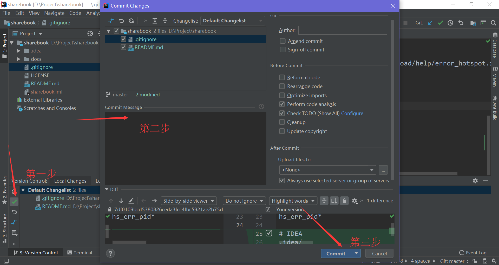
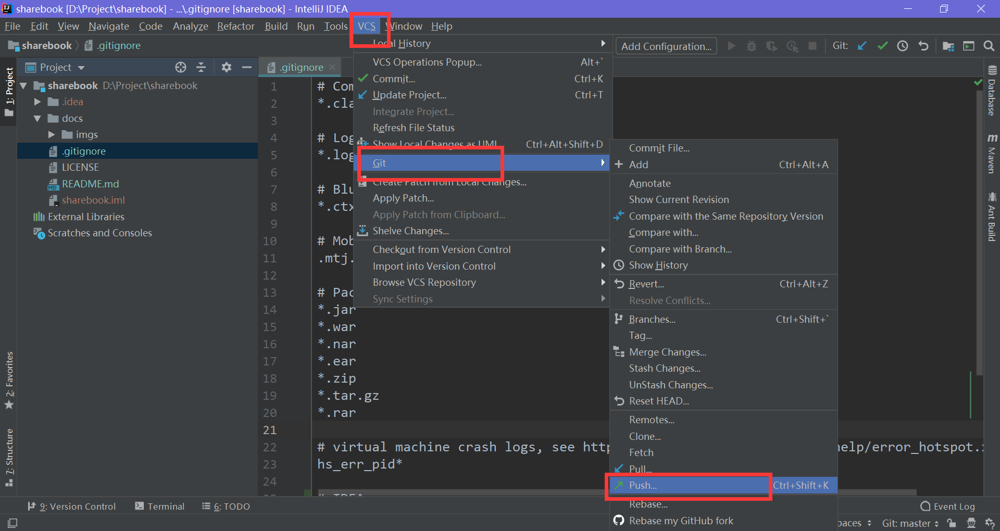

# sharebook

## 如何上手

### 获取项目源码

首先从 github 上获取项目，运行命令`git clone https://github.com/sharebook-org/sharebook.git`

### 提交源码至本地仓库

使用IDEA提交源码，选择下方的`Version Control`按钮，点击绿勾，输入本次修改的信息即可。请勿将`.idea`等与项目无关目录提交。

### 将本地仓库提交至远程仓库

点击IDEA上方的`VCS`按钮，选择`Git`下方的`Push`按钮即可。

## License

遵循MIT协议。