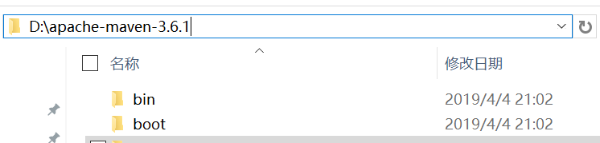
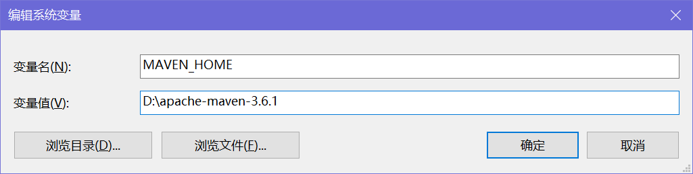
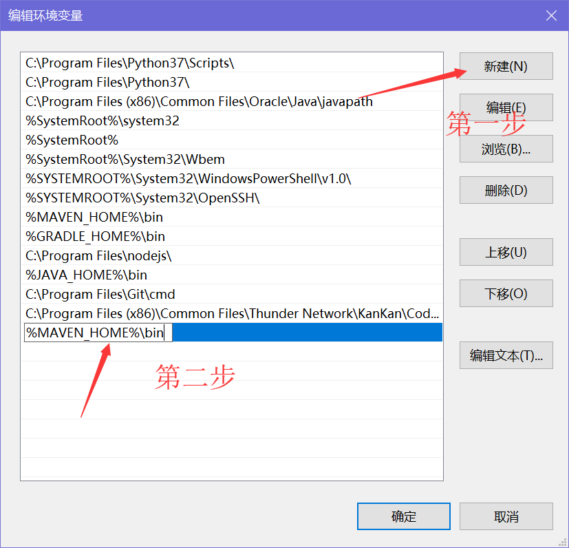
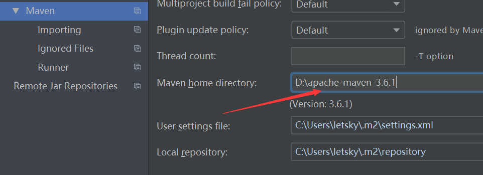

# Maven设置说明

## 下载

- 点击此链接进行下载apache-maven-3.6.1：https://mirrors.tuna.tsinghua.edu.cn/apache/maven/maven-3/3.6.1/binaries/apache-maven-3.6.1-bin.zip。

- 解压下载的文件，并将解压后的文件夹任意地方。

## 环境变量配置 

- 右键[此电脑]  - [属性] - [高级系统设置] - [环境变量]，新建名为`MAVEN_HOME`的系统变量，变量值为maven文件夹所在位置。





- 然后在名为`Path`（不区分大小写）的环境变量下添加项：`%MAVEN_HOME%\bin`。



- 在CMD中输入`mvn -v`，显示版本号即配置成功。

## 配置国内源

- 在`C:\Users\{your computer name}`下新建文件夹`.m2`，复制maven/conf文件夹下的`settings.xml`至`.m2`文件夹下，找到`<mirrors></mirrors>`节点，将以下配置信息插入其中并保存。

```xml
<mirror>  
	<id>alimaven</id>  
	<name>aliyun maven</name>  
	<url>http://maven.aliyun.com/nexus/content/groups/public/</url>;  
	<mirrorOf>central</mirrorOf>          
</mirror>
```

## 配置idea

- 进入idea的设置界面，找到maven设置，填入maven的路径即可。



## 参考链接

[用 Maven 做项目构建](https://www.ibm.com/developerworks/cn/java/j-lo-maven/index.html)

